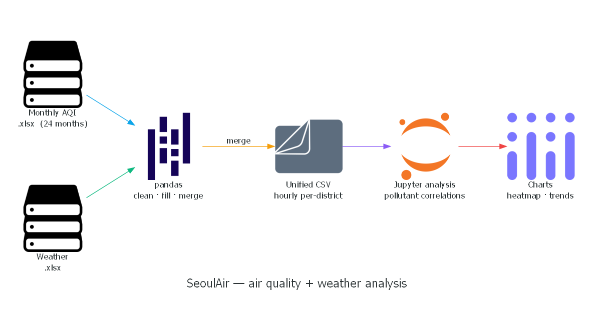
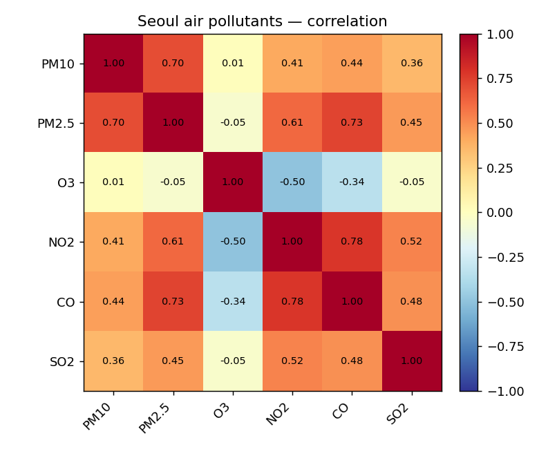
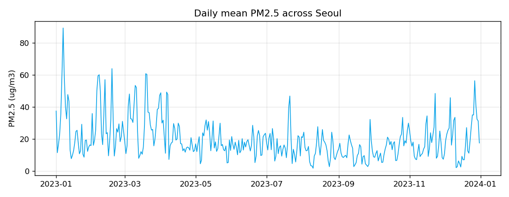
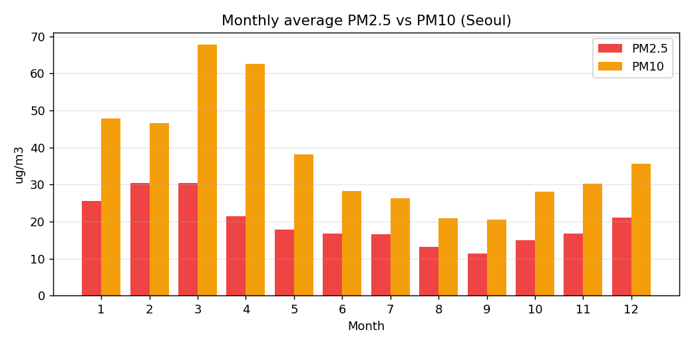

# SeoulAir

Cleans, fills and merges **Seoul air-quality + weather data** (2022–2023) into
unified, analysis-ready datasets, then explores how pollutants relate to each
other and to the weather.

The raw source is monthly Seoul air-quality exports (PM10, PM2.5, O3, NO2, CO,
SO2 by district) plus weather data; the notebook normalizes timestamps, fills
gaps and joins everything into clean tables.

**Stack:** Python · pandas · Matplotlib · Jupyter



*Rendered from [`docs/howitworks.py`](docs/howitworks.py) (Python `diagrams` library).*

## Sample findings

| Pollutant correlations | Daily PM2.5 | Monthly PM2.5 vs PM10 |
| --- | --- | --- |
|  |  |  |

PM2.5 tracks closely with CO and NO2 (combustion/traffic) and rises in winter;
ozone is anti-correlated with NO2 — the expected photochemistry.

## Contents

```
seoulair.ipynb            # data cleaning + merging + correlation analysis
data/cleaned_air_quality_data.csv   # a cleaned sample (Seoul, 2023)
make_charts.py            # regenerates figures/ from the sample
figures/                  # the charts above
```

## Run

```bash
pip install pandas matplotlib
python make_charts.py
```

## Note

The full multi-gigabyte raw exports, merged datasets and weather `.xlsx` files are
not included — `data/` holds a single cleaned sample.
